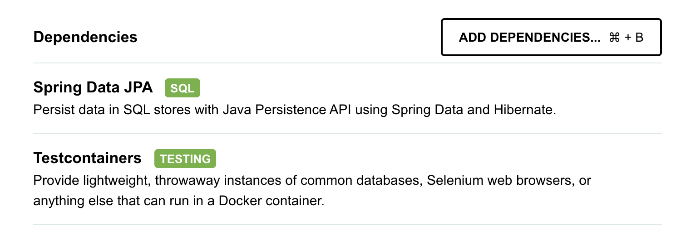

# SpringBoot: Test Container with Mysql Container

1. Create a new project

    

2. Add the dependencies
    
    ```xml
    <dependency>
        <groupId>org.testcontainers</groupId>
        <artifactId>mysql</artifactId>
        <version>1.20.0</version>
        <scope>test</scope>
    </dependency>
    <dependency>
        <groupId>com.mysql</groupId>
        <artifactId>mysql-connector-j</artifactId>
        <version>9.4.0</version>
    </dependency>
    ```
   
3. Create `init.sql` file in `src/test/resources/db/init.sql`

    ```sql
    CREATE TABLE countries(
        id int NOT NULL AUTO_INCREMENT,
        name varchar(64) NOT NULL,
        population int,
        PRIMARY KEY (id)
    );
    ```
   
4. Create entity class `Country.java` at `src/main/java/com/example/testmysqlcontainer/entity`

   ```java
    @Entity
    @Table(name = "countries")
    public class Country {
        @Id
    @GeneratedValue(strategy = GenerationType.IDENTITY)
    @Column(name = "id")
    private Long id;

    @Column(name = "name", nullable = false, length = 64)
    private String name;

    @Column(name = "population")
    private Integer population;

    // getter and setter
    }
   ```
   
5. Create repository class `CountryRepository.java` at `src/main/java/com/example/testmysqlcontainer/repo`
    
    ```java
    @Repository
    public interface CountryRepository extends JpaRepository<Country, Long> {
    }
    ```
   
6. Create config class `JPAConfig.java` at `src/main/java/com/example/testmysqlcontainer/config`

    ```java
    @Configuration
    @EnableJpaRepositories(basePackages = "com.example.testmysqlcontainer.repo")
    public class JPAConfig {
    }
    ```
   
7. Create test class `CountryRepositoryTest.java` at `src/test/java/com/example/testmysqlcontainer/repo`

    ```java
    @DataJpaTest()
    @Testcontainers
    @AutoConfigureTestDatabase(replace = AutoConfigureTestDatabase.Replace.NONE)
    class CountryRepositoryTest {
    
        @Container
        @ServiceConnection
        private static final MySQLContainer mySQLContainer;
    
        static {
            mySQLContainer = new MySQLContainer<>("mysql:8.3.0");
            mySQLContainer.withCopyFileToContainer(MountableFile.forClasspathResource("db/init.sql"), "/docker-entrypoint-initdb.d/");
        }
    
        @Autowired
        private CountryRepository countryRepository;
    
        @Test
        public void InsertCountry() {
            Country country = new Country();
            country.setName("Thailand");
            country.setPopulation(60000000);
    
            Country savedCountry = countryRepository.save(country);
    
            assertNotNull(savedCountry.getId());
            assertEquals(1, savedCountry.getId());
            assertEquals(country.getName(), savedCountry.getName());
            assertEquals(country.getPopulation(), savedCountry.getPopulation());
        }
    }
    ```
   
8. Add `@Disable` to `TestmysqlcontainerApplicationTests.java` at `src/test/java/com/example/testmysqlcontainer`

    ```java
    @SpringBootTest
    @Disabled
    class TestmysqlcontainerApplicationTests {
    }
    ```
   
9. Run the test
    ```shell
    ./mvnw clean test
    ```